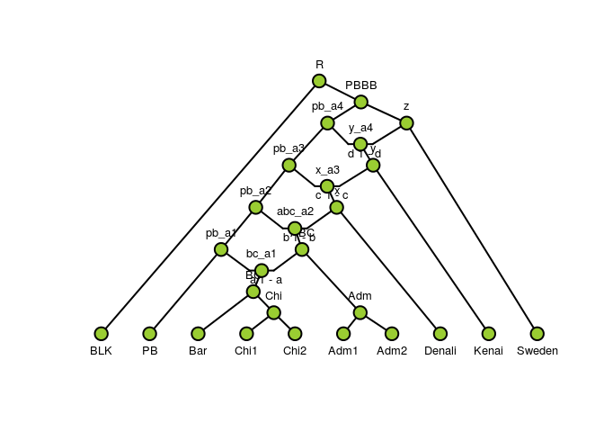
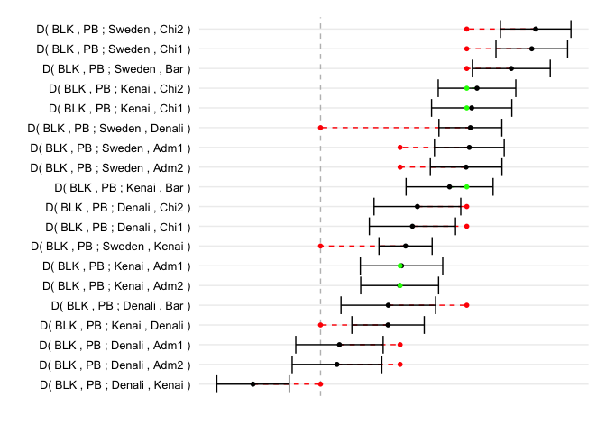

<!-- README.md is generated from README.Rmd. Please edit that file -->
Admixture Graph Manipulation and Fitting
========================================

The package provides functionality to analyse and test admixture graphs against the f statisticsdescribed in the paper [Ancient Admixture in Human History](http://tinyurl.com/o5a4kr4), Patternson *et al.*, Genetics, Vol. 192, 1065--1093, 2012.

The f statistics --- f2, f3, and f4 --- extract information about correlations between gene frequencies in different populations (or single diploid genome samples), which can be informative about patterns of gene flow between these populations in form of admixture events. If a graph is constructed as a hypothesis for the relationship between the populations, equations for the expected values of the f statistics can be extracted, as functions of edge lenghs — representing genetic drift — and admixture proportions.

This package provides functions for extracting these equations and for fitting them against computed f statistics. It does not currently provide functions for computing the f statistics — for that we refer to the [ADMIXTOOLS](https://github.com/DReichLab/AdmixTools) software package.

Example
-------

Below is a quick example of how the package can be used. The example uses data from polar bears and brown bears with a black bear as outgroup. The BLK sample is the black bear, the PB and AK populations are polar bears, and the rest are brown bears. There are two populations of so-called ABC bears, ABC\_A and ABC\_BC, a population of Yellow Stone bears, YB, and a population of European brown bears, EBB.

Using ADMIXTOOLS I have computed f4 statistics --- there called D statistics --- and have the results:

``` r
data(bears)
bears
#>      W      X      Y      Z       D Z.value
#> 1  BLK     AK ABC_BC    EBB -0.1543 -29.149
#> 2  BLK     PB ABC_BC    EBB -0.1524 -28.918
#> 3  BLK     PB  ABC_A    EBB -0.1322 -26.263
#> 4  BLK     AK  ABC_A    EBB -0.1327 -26.054
#> 5  BLK     PB     YB    EBB -0.0865 -18.835
#> 6  BLK     AK     YB    EBB -0.0872 -18.687
#> 7  BLK     AK ABC_BC     YB -0.0796 -12.338
#> 8  BLK     PB ABC_BC     YB -0.0781 -12.091
#> 9  BLK     PB  ABC_A     YB -0.0554  -8.945
#> 10 BLK     AK  ABC_A     YB -0.0554  -8.902
#> 11 BLK     AK ABC_BC  ABC_A -0.0275  -4.784
#> 12 BLK     PB ABC_BC  ABC_A -0.0255  -4.519
#> 13 BLK  ABC_A     PB     AK  0.0011   0.213
#> 14 BLK    EBB     PB     AK  0.0106   2.155
#> 15 BLK ABC_BC     PB     AK  0.0175   3.148
#> 16 BLK     YB     PB     AK  0.0195   3.397
#> 17 BLK     PB  ABC_A ABC_BC  0.0255   4.519
#> 18 BLK     AK  ABC_A ABC_BC  0.0275   4.784
#> 19 BLK     AK     YB  ABC_A  0.0554   8.902
#> 20 BLK     PB     YB  ABC_A  0.0554   8.945
#> 21 BLK     PB     YB ABC_BC  0.0781  12.091
#> 22 BLK     AK     YB ABC_BC  0.0796  12.338
#> 23 BLK     AK    EBB     YB  0.0872  18.687
#> 24 BLK     PB    EBB     YB  0.0865  18.835
#> 25 BLK     AK    EBB  ABC_A  0.1327  26.054
#> 26 BLK     PB    EBB  ABC_A  0.1322  26.263
#> 27 BLK     PB    EBB ABC_BC  0.1524  28.918
#> 28 BLK     AK    EBB ABC_BC  0.1543  29.149
```

The D column is the f4(W,X;Y,Z) statistic and the Z column is the Z-values obtained from a blocked jacknife (see Patterson *et al.* for details).

From the statistics we can see that the ABC bears are closer related to the polar bears compared to the other brown bears and that the Yellow Stone bears are closer to the polar bears than the European bears, and also that the two populations of ABC bears are not equally pulled towards the polar bears.

We can explain this by several waves of admixture from ancestral polar bears into brown bears, so a first attempt of a graph can be constructed as this:

``` r
leaves <- c("BLK", "PB", "AK", "ABC_BC", "ABC_A", "YB", "EBB") 
inner_nodes <- c("R", "a", "b", "c", "d", "e", "f", "g", "h",
                 "abc_bc", "G", "E")

edges <- parent_edges(c(edge("BLK", "R"),
                        edge("PB", "h"),
                        edge("AK", "h"),
                        edge("ABC_BC", "abc_bc"),
                        admixture_edge("abc_bc", "f", "g"),
                        edge("ABC_A", "g"), 
                        edge("YB", "e"),
                        edge("EBB", "c"),
                        edge("h", "f"),
                        edge("f", "d"),
                        edge("g", "G"),
                        admixture_edge("G", "d", "e"),
                        edge("d", "b"),
                        edge("e", "E"),
                        admixture_edge("E", "b", "c"),
                        edge("b", "a"),
                        edge("c", "a"),
                        edge("a", "R")))
 

admixtures <- admixture_proportions(c(admix_props("abc_bc", "f", "g", "alpha"),
                                      admix_props("G", "d", "e", "beta"),
                                      admix_props("E", "b", "c", "gamma")))
                                
bears_graph <- agraph(leaves, inner_nodes, edges, admixtures)
plot(bears_graph, show_inner_node_labels = TRUE, show_admixture_labels = TRUE)
```



The graph makes predictions on how the f4 statistics should look, in particular it allows us to predict the signs of the f4 statistics.

``` r
add_graph_f4_sign(bears, bears_graph)
#>      W      X      Y      Z       D Z.value graph_f4_sign
#> 1  BLK     AK ABC_BC    EBB -0.1543 -29.149            -1
#> 2  BLK     PB ABC_BC    EBB -0.1524 -28.918            -1
#> 3  BLK     PB  ABC_A    EBB -0.1322 -26.263            -1
#> 4  BLK     AK  ABC_A    EBB -0.1327 -26.054            -1
#> 5  BLK     PB     YB    EBB -0.0865 -18.835            -1
#> 6  BLK     AK     YB    EBB -0.0872 -18.687            -1
#> 7  BLK     AK ABC_BC     YB -0.0796 -12.338            -1
#> 8  BLK     PB ABC_BC     YB -0.0781 -12.091            -1
#> 9  BLK     PB  ABC_A     YB -0.0554  -8.945            -1
#> 10 BLK     AK  ABC_A     YB -0.0554  -8.902            -1
#> 11 BLK     AK ABC_BC  ABC_A -0.0275  -4.784            -1
#> 12 BLK     PB ABC_BC  ABC_A -0.0255  -4.519            -1
#> 13 BLK  ABC_A     PB     AK  0.0011   0.213             0
#> 14 BLK    EBB     PB     AK  0.0106   2.155             0
#> 15 BLK ABC_BC     PB     AK  0.0175   3.148             0
#> 16 BLK     YB     PB     AK  0.0195   3.397             0
#> 17 BLK     PB  ABC_A ABC_BC  0.0255   4.519             1
#> 18 BLK     AK  ABC_A ABC_BC  0.0275   4.784             1
#> 19 BLK     AK     YB  ABC_A  0.0554   8.902             1
#> 20 BLK     PB     YB  ABC_A  0.0554   8.945             1
#> 21 BLK     PB     YB ABC_BC  0.0781  12.091             1
#> 22 BLK     AK     YB ABC_BC  0.0796  12.338             1
#> 23 BLK     AK    EBB     YB  0.0872  18.687             1
#> 24 BLK     PB    EBB     YB  0.0865  18.835             1
#> 25 BLK     AK    EBB  ABC_A  0.1327  26.054             1
#> 26 BLK     PB    EBB  ABC_A  0.1322  26.263             1
#> 27 BLK     PB    EBB ABC_BC  0.1524  28.918             1
#> 28 BLK     AK    EBB ABC_BC  0.1543  29.149             1
```

The way the signs are predicted is by extracting the equations for the f4 statistics that the graph implies: For each quartet of leaves we can extract an equation for the corresponding f4 statistics --- an equation in the edge lenghts and admixture proportions --- and if this equation only have positive values we know that the sign must be positive, if it only has negative values we know that it must be negative, and if it constant zero we know it must be zero.

For example

``` r
sf4(bears_graph, "BLK", "PB", "ABC_A", "EBB")
#> expression(beta * (-edge_a_b - edge_b_d) + (1 - beta) * gamma * 
#>     (-edge_a_b))
```

only has negative terms so we know it must be negative.

In general we will not always have only positive or negative terms, in which case we cannot this simply predict the sign for f4 statistics. If this is the case we need to set the parameters of the graph --- the edge lengths and admixture proportions --- to get the sign, and in that case we can also predict the numerical value of the f4 statistics from the graph.

Fitting a graph to data
-----------------------

If you have the *neldermead* package installed you can also fit graph parameters to data. This is done using the *fit\_graph* function

``` r
fit <- fit_graph(bears, bears_graph)
#> fminbnd:  Exiting: Maximum number of function evaluations has been exceeded
#>          - increase MaxFunEvals option.
#>          Current function value: 0.00716211041293003
fit
#> Call:
#> fit_graph(bears, bears_graph)
#> 
#> Sum of squared error: 0.00716211
```

The object it returns contains an environment that contains the fitted parameters and a data frame containing the original data together with an extra column, graph\_f4, containing the fitted values.

You can get the fitted values by calling the *summary* function.

``` r
summary(fit)
#> $edges
#>         edge_R_BLK           edge_R_a           edge_a_b 
#>         0.03189328         0.99999900         0.16466509 
#>           edge_a_c           edge_b_d           edge_b_E 
#>         0.66494923         0.00000100         0.99999900 
#>         edge_c_EBB           edge_c_E           edge_d_f 
#>         0.00000100         0.08707048         0.13737071 
#>           edge_d_G          edge_e_YB           edge_e_G 
#>         0.67160748         0.54429194         0.04185963 
#>           edge_f_h      edge_f_abc_bc       edge_g_ABC_A 
#>         0.00000100         0.06540492         0.35680992 
#>      edge_g_abc_bc          edge_h_PB          edge_h_AK 
#>         0.97772638         0.46456084         0.14943092 
#> edge_abc_bc_ABC_BC           edge_G_g           edge_E_e 
#>         0.63877370         0.00000100         0.63795240 
#> 
#> $admixture_proportions
#>     gamma      beta     alpha 
#> 0.5362435 0.6969830 0.0000010
```

This function also returns the fitted values as a list, so you can assign the result to an object if you need to access it later.

You can also get the fitted parameters using the generic *coef* or *coefficients* funcions

``` r
coef(fit)
#>         edge_R_BLK           edge_R_a           edge_a_b 
#>         0.03189328         0.99999900         0.16466509 
#>           edge_a_c           edge_b_d           edge_b_E 
#>         0.66494923         0.00000100         0.99999900 
#>         edge_c_EBB           edge_c_E           edge_d_f 
#>         0.00000100         0.08707048         0.13737071 
#>           edge_d_G          edge_e_YB           edge_e_G 
#>         0.67160748         0.54429194         0.04185963 
#>           edge_f_h      edge_f_abc_bc       edge_g_ABC_A 
#>         0.00000100         0.06540492         0.35680992 
#>      edge_g_abc_bc          edge_h_PB          edge_h_AK 
#>         0.97772638         0.46456084         0.14943092 
#> edge_abc_bc_ABC_BC           edge_G_g           edge_E_e 
#>         0.63877370         0.00000100         0.63795240 
#>              gamma               beta              alpha 
#>         0.53624353         0.69698298         0.00000100
```

To get the fitted predictions, together with the data used for fitting, use the *fitted* function.

``` r
fitted(fit)
#>      W      X      Y      Z       D Z.value      graph_f4
#> 1  BLK     AK ABC_BC    EBB -0.1543 -29.149 -1.415262e-01
#> 2  BLK     PB ABC_BC    EBB -0.1524 -28.918 -1.415262e-01
#> 3  BLK     PB  ABC_A    EBB -0.1322 -26.263 -1.415260e-01
#> 4  BLK     AK  ABC_A    EBB -0.1327 -26.054 -1.415260e-01
#> 5  BLK     PB     YB    EBB -0.0865 -18.835 -8.830059e-02
#> 6  BLK     AK     YB    EBB -0.0872 -18.687 -8.830059e-02
#> 7  BLK     AK ABC_BC     YB -0.0796 -12.338 -5.322562e-02
#> 8  BLK     PB ABC_BC     YB -0.0781 -12.091 -5.322562e-02
#> 9  BLK     PB  ABC_A     YB -0.0554  -8.945 -5.322546e-02
#> 10 BLK     AK  ABC_A     YB -0.0554  -8.902 -5.322546e-02
#> 11 BLK     AK ABC_BC  ABC_A -0.0275  -4.784 -1.605108e-07
#> 12 BLK     PB ABC_BC  ABC_A -0.0255  -4.519 -1.605108e-07
#> 13 BLK  ABC_A     PB     AK  0.0011   0.213  0.000000e+00
#> 14 BLK    EBB     PB     AK  0.0106   2.155  0.000000e+00
#> 15 BLK ABC_BC     PB     AK  0.0175   3.148  0.000000e+00
#> 16 BLK     YB     PB     AK  0.0195   3.397  0.000000e+00
#> 17 BLK     PB  ABC_A ABC_BC  0.0255   4.519  1.605108e-07
#> 18 BLK     AK  ABC_A ABC_BC  0.0275   4.784  1.605108e-07
#> 19 BLK     AK     YB  ABC_A  0.0554   8.902  5.322546e-02
#> 20 BLK     PB     YB  ABC_A  0.0554   8.945  5.322546e-02
#> 21 BLK     PB     YB ABC_BC  0.0781  12.091  5.322562e-02
#> 22 BLK     AK     YB ABC_BC  0.0796  12.338  5.322562e-02
#> 23 BLK     AK    EBB     YB  0.0872  18.687  8.830059e-02
#> 24 BLK     PB    EBB     YB  0.0865  18.835  8.830059e-02
#> 25 BLK     AK    EBB  ABC_A  0.1327  26.054  1.415260e-01
#> 26 BLK     PB    EBB  ABC_A  0.1322  26.263  1.415260e-01
#> 27 BLK     PB    EBB ABC_BC  0.1524  28.918  1.415262e-01
#> 28 BLK     AK    EBB ABC_BC  0.1543  29.149  1.415262e-01
```

You can make a plot of the fit against the data using the *plot* function.

``` r
plot(fit)
```



The plot shows the data f4 statistics with error bars (in black) plus the predicted values from the graph.

The result of this is a ggplot2 object that you can modify by adding ggplot2 commands in the usual way.
