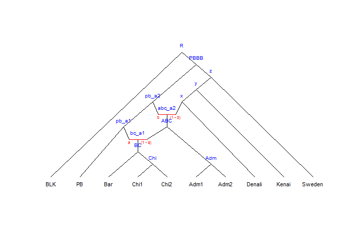

<!-- README.md is generated from README.Rmd. Please edit that file -->
Admixture Graph Manipulation and Fitting
========================================

The package provides functionality to analyse and test admixture graphs against the f statisticsdescribed in the paper [Ancient Admixture in Human History](http://tinyurl.com/o5a4kr4), Patternson *et al.*, Genetics, Vol. 192, 1065--1093, 2012.

The f statistics --- f2, f3, and f4 --- extract information about correlations between gene frequencies in different populations (or single diploid genome samples), which can be informative about patterns of gene flow between these populations in form of admixture events. If a graph is constructed as a hypothesis for the relationship between the populations, equations for the expected values of the f statistics can be extracted, as functions of edge lenghs — representing genetic drift — and admixture proportions.

This package provides functions for extracting these equations and for fitting them against computed f statistics. It does not currently provide functions for computing the f statistics — for that we refer to the [ADMIXTOOLS](https://github.com/DReichLab/AdmixTools) software package.

Example
-------

Below is a quick example of how the package can be used. The example uses data from polar bears and brown bears with a black bear as outgroup and is taken from [Genomic evidence of geographically widespread effect of gene flow from polar bears into brown bears](http://onlinelibrary.wiley.com/doi/10.1111/mec.13038/abstract).

The BLK sample is the black bear, the PB sample is a polar bear, and the rest are brown bears.

I have taken the D statistics from Table 1 in the paper and have the statistics:

``` r
data(bears)
bears
#>      W  X      Y      Z       D Z.value
#> 1  BLK PB Sweden   Adm1  0.1258    12.8
#> 2  BLK PB  Kenai   Adm1  0.0685     5.9
#> 3  BLK PB Denali   Adm1  0.0160     1.3
#> 4  BLK PB Sweden   Adm2  0.1231    12.2
#> 5  BLK PB  Kenai   Adm2  0.0669     6.1
#> 6  BLK PB Denali   Adm2  0.0139     1.1
#> 7  BLK PB Sweden    Bar  0.1613    14.7
#> 8  BLK PB  Kenai    Bar  0.1091     8.9
#> 9  BLK PB Denali    Bar  0.0573     4.3
#> 10 BLK PB Sweden   Chi1  0.1786    17.7
#> 11 BLK PB  Kenai   Chi1  0.1278    11.3
#> 12 BLK PB Denali   Chi1  0.0777     6.4
#> 13 BLK PB Sweden   Chi2  0.1819    18.3
#> 14 BLK PB  Kenai   Chi2  0.1323    12.1
#> 15 BLK PB Denali   Chi2  0.0819     6.7
#> 16 BLK PB Sweden Denali  0.1267    14.3
#> 17 BLK PB  Kenai Denali  0.0571     5.6
#> 18 BLK PB Sweden  Kenai  0.0719     9.6
#> 19 BLK PB Denali  Kenai -0.0571    -5.6
```

The D column is the f4(W,X;Y,Z) statistic and the Z column is the Z-values obtained from a blocked jacknife (see Patterson *et al.* for details).

From the statistics we can see that the ABC bears (Adm, Bar and Chi) are closer related to the polar bears compared to the other brown bears. The paper explains this with gene flow from polar bears into the ABC bears and going further out from there, but we can also explain this by several waves of admixture from ancestral polar bears into brown bears:

``` r
leaves <- c("BLK", "PB",
            "Bar", "Chi1", "Chi2", "Adm1", "Adm2",
            "Denali", "Kenai", "Sweden") 
inner_nodes <- c("R", "PBBB",
                 "Adm", "Chi", "BC", "ABC",
                 "x", "y", "z",
                 "pb_a1", "pb_a2", "pb_a3", "pb_a4",
                 "bc_a1", "abc_a2", "x_a3", "y_a4")

edges <- parent_edges(c(edge("BLK", "R"),
                        edge("PB", "pb_a1"),
                        edge("pb_a1", "pb_a2"),
                        edge("pb_a2", "pb_a3"),
                        edge("pb_a3", "pb_a4"),
                        edge("pb_a4", "PBBB"),
                        
                        edge("Chi1", "Chi"),
                        edge("Chi2", "Chi"),
                        edge("Chi", "BC"),
                        edge("Bar", "BC"),
                        edge("BC", "bc_a1"),
                        
                        edge("Adm1", "Adm"),
                        edge("Adm2", "Adm"),
                        
                        admixture_edge("bc_a1", "pb_a1", "ABC"),
                        edge("Adm", "ABC"),
                        
                        edge("ABC", "abc_a2"),
                        admixture_edge("abc_a2", "pb_a2", "x"),
                        
                        edge("Denali", "x"),
                        edge("x", "x_a3"),
                        admixture_edge("x_a3", "pb_a3", "y"),
                      
                        edge("Kenai", "y"),
                        edge("y", "y_a4"),                        
                        admixture_edge("y_a4", "pb_a4", "z"),
                        
                        edge("Sweden", "z"),
                        
                        edge("z", "PBBB"),
                        edge("PBBB", "R")))
 

admixtures <- admixture_proportions(c(admix_props("bc_a1", "pb_a1", "ABC", "a"),
                                      admix_props("abc_a2", "pb_a2", "x", "b"),
                                      admix_props("x_a3", "pb_a3", "y", "c"),
                                      admix_props("y_a4", "pb_a4", "z", "d")))
                                
bears_graph <- agraph(leaves, inner_nodes, edges, admixtures)
plot(bears_graph, show_inner_node_labels = TRUE, show_admixture_labels = TRUE)
```



Fitting a graph to data
-----------------------

The graph makes predictions on how the f4 statistics should look. If you have the *neldermead* package installed you can fit graph parameters to observed D statistics. This is done using the *fit\_graph* function

``` r
fit <- fit_graph(bears, bears_graph, optimset(MaxFunEvals=100000))
fit
#> Call:
#> fit_graph(bears, bears_graph, optimset(MaxFunEvals = 1e+05))
#> 
#> Sum of squared error: 0.00152768
```

The object it returns contains an environment that contains the fitted parameters and a data frame containing the original data together with an extra column, graph\_f4, containing the fitted values.

You can get the fitted values by calling the *summary* function.

``` r
summary(fit)
#> $edges
#>        edge_R_BLK       edge_R_PBBB       edge_PBBB_z   edge_PBBB_pb_a4 
#>        0.48280400        0.35334025        0.20544148        0.09400681 
#>     edge_Adm_Adm1     edge_Adm_Adm2     edge_Chi_Chi1     edge_Chi_Chi2 
#>        0.43927435        0.61508755        0.57871199        0.41215334 
#>       edge_BC_Bar       edge_BC_Chi      edge_ABC_Adm    edge_ABC_bc_a1 
#>        0.56786089        0.15152401        0.32464937        0.36194069 
#>     edge_x_Denali     edge_x_abc_a2      edge_y_Kenai       edge_y_x_a3 
#>        0.55402436        0.25665913        0.28996419        0.27422166 
#>     edge_z_Sweden       edge_z_y_a4     edge_pb_a1_PB  edge_pb_a1_bc_a1 
#>        0.21095794        0.22471392        0.47904766        0.17697982 
#>  edge_pb_a2_pb_a1 edge_pb_a2_abc_a2  edge_pb_a3_pb_a2   edge_pb_a3_x_a3 
#>        0.06448725        0.47719996        0.06344493        0.30438053 
#>  edge_pb_a4_pb_a3   edge_pb_a4_y_a4     edge_bc_a1_BC   edge_abc_a2_ABC 
#>        0.07438701        0.42705823        0.49725335        0.42610375 
#>       edge_x_a3_x       edge_y_a4_y 
#>        0.45304760        0.26846672 
#> 
#> $admixture_proportions
#>         a         b         c         d 
#> 0.3078550 0.1166945 0.5109548 0.6357136
```

This function also returns the fitted values as a list, so you can assign the result to an object if you need to access it later.

You can also get the fitted parameters using the generic *coef* or *coefficients* funcions

``` r
coef(fit)
#>        edge_R_BLK       edge_R_PBBB       edge_PBBB_z   edge_PBBB_pb_a4 
#>        0.48280400        0.35334025        0.20544148        0.09400681 
#>     edge_Adm_Adm1     edge_Adm_Adm2     edge_Chi_Chi1     edge_Chi_Chi2 
#>        0.43927435        0.61508755        0.57871199        0.41215334 
#>       edge_BC_Bar       edge_BC_Chi      edge_ABC_Adm    edge_ABC_bc_a1 
#>        0.56786089        0.15152401        0.32464937        0.36194069 
#>     edge_x_Denali     edge_x_abc_a2      edge_y_Kenai       edge_y_x_a3 
#>        0.55402436        0.25665913        0.28996419        0.27422166 
#>     edge_z_Sweden       edge_z_y_a4     edge_pb_a1_PB  edge_pb_a1_bc_a1 
#>        0.21095794        0.22471392        0.47904766        0.17697982 
#>  edge_pb_a2_pb_a1 edge_pb_a2_abc_a2  edge_pb_a3_pb_a2   edge_pb_a3_x_a3 
#>        0.06448725        0.47719996        0.06344493        0.30438053 
#>  edge_pb_a4_pb_a3   edge_pb_a4_y_a4     edge_bc_a1_BC   edge_abc_a2_ABC 
#>        0.07438701        0.42705823        0.49725335        0.42610375 
#>       edge_x_a3_x       edge_y_a4_y                 a                 b 
#>        0.45304760        0.26846672        0.30785495        0.11669447 
#>                 c                 d 
#>        0.51095484        0.63571360
```

To get the fitted predictions, together with the data used for fitting, use the *fitted* function.

``` r
fitted(fit)
#>      W  X      Y      Z       D Z.value    graph_f4
#> 1  BLK PB Sweden   Adm1  0.1258    12.8  0.12887086
#> 2  BLK PB  Kenai   Adm1  0.0685     5.9  0.06910946
#> 3  BLK PB Denali   Adm1  0.0160     1.3  0.01360320
#> 4  BLK PB Sweden   Adm2  0.1231    12.2  0.12887086
#> 5  BLK PB  Kenai   Adm2  0.0669     6.1  0.06910946
#> 6  BLK PB Denali   Adm2  0.0139     1.1  0.01360320
#> 7  BLK PB Sweden    Bar  0.1613    14.7  0.18042276
#> 8  BLK PB  Kenai    Bar  0.1091     8.9  0.12066135
#> 9  BLK PB Denali    Bar  0.0573     4.3  0.06515509
#> 10 BLK PB Sweden   Chi1  0.1786    17.7  0.18042276
#> 11 BLK PB  Kenai   Chi1  0.1278    11.3  0.12066135
#> 12 BLK PB Denali   Chi1  0.0777     6.4  0.06515509
#> 13 BLK PB Sweden   Chi2  0.1819    18.3  0.18042276
#> 14 BLK PB  Kenai   Chi2  0.1323    12.1  0.12066135
#> 15 BLK PB Denali   Chi2  0.0819     6.7  0.06515509
#> 16 BLK PB Sweden Denali  0.1267    14.3  0.11526766
#> 17 BLK PB  Kenai Denali  0.0571     5.6  0.05550626
#> 18 BLK PB Sweden  Kenai  0.0719     9.6  0.05976141
#> 19 BLK PB Denali  Kenai -0.0571    -5.6 -0.05550626
```

You can make a plot of the fit against the data using the *plot* function.

``` r
plot(fit)
```


The plot shows the data f4 statistics with error bars (in black) plus the predicted values from the graph.

The result of this is a ggplot2 object that you can modify by adding ggplot2 commands in the usual way.
