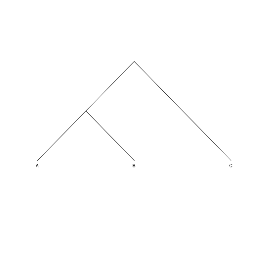
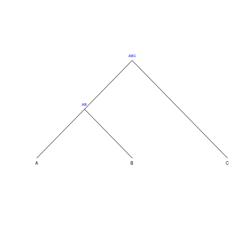
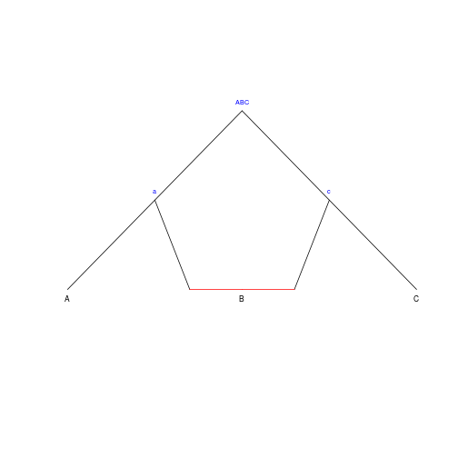
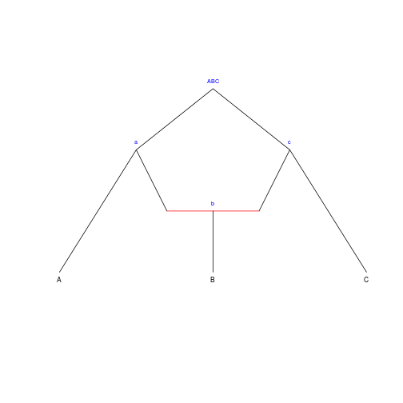
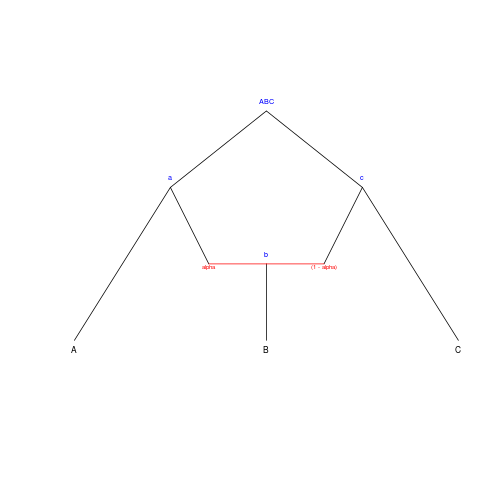
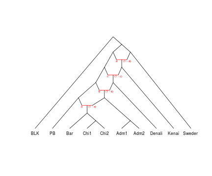
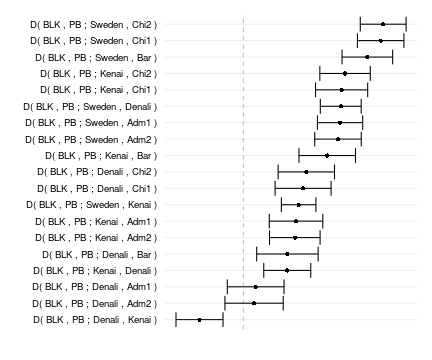
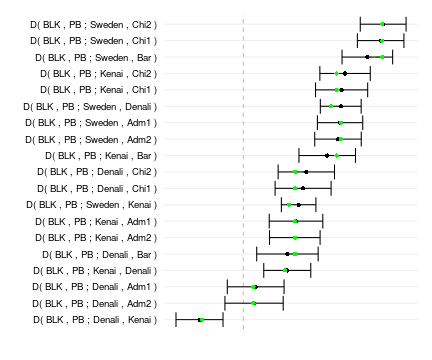

This document describes the `admixturegraph` package, a package for fitting admixture graphs to genetic data.

The package enables you to specify admixture graphs, extract the implied equations a given graph makes for predicting correlations of genetic drift as specified by the expected $f_2$, $f_3$ and $f_4$ statistics, or fit a graph to data summarized as $D$ statistics and test the goodness of fit.

The package does not (yet) support graph inference or functionality for exploring the graph space over a set of populations.


# Admixture graphs and genetic drift

Gene frequencies in related populations are correlated. If two populations split apart a certain time in the past, all gene frequencies were the same at that split time---where the populations were one and the same---and has since drifted apart in the time since---where the populations have evolved independently.

With three related populations where one branched off a common ancestor early and the other two later in time the two closest related populations will, all else being equal, have more correlated gene frequencies than they have with the third population. 

All else being equal here means that the populations should have evolved at roughly the same speed---the gene frequency changes should not be more dramatic in one population than another. If we consider populations A, B and C, with A and B closest relatives but where population A has changed very rapidly since it split from population B, then gene frequencies in A and B could be less correlated than between B and C (but A and C would be even less correlated).

 

The way gene frequencies change over time as a population evolve is called genetic drift and the way gene frequencies are correlated between populations is determined by how they are related. These relationships can be simple trees with ancestral populations split into descendant populations or be more complex with gene flow between diverged populations.

Assuming that populations evolve by either splitting into descendant populations or merging in admixture events---but do not experience periods of continuous gene flow---their relationship can be described as a so-called *admixture graph* [@Patterson:ADMIXTOOLS]. Such a graph not only describes the history of the populations but can also be seen as a specification of how gene frequencies in the populations will be correlated. Different summary statistics can capture the correlations in gene frequencies between populations, extracting different aspects of this correlation, and the expected values of these statistics can be computed as polynomials over branch lengths and admixture proportions in the admixture graph.


# Building admixture graphs

In the `admixturegraph` package, graphs are build by specifying the edges in the graph and naming the admixture proportions so these have a variable associated.

It is first necessary to specify the nodes in the graphs, where there is a distinction between leaves and inner nodes so leaves later can correspond to values in $f$ statistics computed from genetic data. It is necessary to name the nodes so we have something to refer to when specifying the edges.

Edges are specified by specifying the parent of each node. Only one node is allowed not to have a parent; the package cannot deal with more than one root.

The tree shown above is specified as:


```r
leaves <- c("A", "B", "C")
inner_nodes <- c("AB", "ABC")
edges <- parent_edges(c(edge("A", "AB"),
                        edge("B", "AB"),
                        edge("AB", "ABC"),
                        edge("C", "ABC")))
graph <- agraph(leaves, inner_nodes, edges, NULL)
```

and plotted like:


```r
plot(graph)  
```

 

By default the labels on inner nodes are not shown but this can be changed by:


```r
plot(graph, show_inner_node_labels = TRUE)  
```

 

The left-to-right order of leaves in plots is always the same as the order given when constructing the graph; there is currently no good layout algorithm implemented for plotting so this is the only way of controlling the plots.

Admixture events are specified by having admixture edges. These are edges with two parents. Admixture edges really represent two different edges, capturing the drift between the two populations ancestral to the admixture event before the admixture took place, so we typically have to add inner nodes on the edges where these two ancestral populations branched off other lineages in the graph.


```r
leaves <- c("A", "B", "C")
inner_nodes <- c("a", "c", "ABC")
edges <- parent_edges(c(edge("A", "a"), edge("a", "ABC"),
                        edge("C", "c"), edge("c", "ABC"),
                        admixture_edge("B", "a", "c")))
graph <- agraph(leaves, inner_nodes, edges, NULL)

plot(graph, show_inner_node_labels = TRUE)
```

 

Since we usually model admixtures that happened at some point in the past we usually also need an inner node above the present day admixed population.


```r
leaves <- c("A", "B", "C")
inner_nodes <- c("a", "c", "b", "ABC")
edges <- parent_edges(c(edge("A", "a"), edge("a", "ABC"),
                        edge("C", "c"), edge("c", "ABC"),
                        edge("B", "b"),
                        admixture_edge("b", "a", "c")))
graph <- agraph(leaves, inner_nodes, edges, NULL)

plot(graph, show_inner_node_labels = TRUE)
```

 

This graph doesn't contain a variable for the admixture proportions between the two ancestral populations to B. To work with the equations for expected drift statistics we need to specify this as well.

This is done through the last parameter when constructing the admixture graph, like this:


```r
leaves <- c("A", "B", "C")
inner_nodes <- c("a", "c", "b", "ABC")
edges <- parent_edges(c(edge("A", "a"), edge("a", "ABC"),
                        edge("C", "c"), edge("c", "ABC"),
                        edge("B", "b"),
                        admixture_edge("b", "a", "c")))
admixtures <- admixture_proportions(c(
    admix_props("b", "a", "c", "alpha")
    ))
graph <- agraph(leaves, inner_nodes, edges, admixtures)

plot(graph, show_inner_node_labels = TRUE, show_admixture_labels = TRUE)
```

 

## A more complex example

As a somewhat more complex example we can build a graph for samples of polar and brown bears described in [@Cahill:2014fo]. Although the model suggested there for the relationship between polar bears and brown bears is more along the lines of gene flow from polar bears into one population of brown bears and then spread from there, we can also model the different levels of relatedness between the polar and brown bears by direct gene flow from polar bears into the ancestors of the different samples of brown bears with more and more such events in the ancestry of those that are closer related to polar bears.

A graph constructed to capture this could look like:


```r
leaves <- c("BLK", "PB",
            "Bar", "Chi1", "Chi2", "Adm1", "Adm2",
            "Denali", "Kenai", "Sweden") 
inner_nodes <- c("R", "PBBB",
                 "Adm", "Chi", "BC", "ABC",
                 "x", "y", "z",
                 "pb_a1", "pb_a2", "pb_a3", "pb_a4",
                 "bc_a1", "abc_a2", "x_a3", "y_a4")

edges <- parent_edges(c(edge("BLK", "R"),
                        edge("PB", "pb_a1"),
                        edge("pb_a1", "pb_a2"),
                        edge("pb_a2", "pb_a3"),
                        edge("pb_a3", "pb_a4"),
                        edge("pb_a4", "PBBB"),
                        
                        edge("Chi1", "Chi"),
                        edge("Chi2", "Chi"),
                        edge("Chi", "BC"),
                        edge("Bar", "BC"),
                        edge("BC", "bc_a1"),
                        
                        edge("Adm1", "Adm"),
                        edge("Adm2", "Adm"),
                        
                        admixture_edge("bc_a1", "pb_a1", "ABC"),
                        edge("Adm", "ABC"),
                        
                        edge("ABC", "abc_a2"),
                        admixture_edge("abc_a2", "pb_a2", "x"),
                        
                        edge("Denali", "x"),
                        edge("x", "x_a3"),
                        admixture_edge("x_a3", "pb_a3", "y"),
                      
                        edge("Kenai", "y"),
                        edge("y", "y_a4"),                        
                        admixture_edge("y_a4", "pb_a4", "z"),
                        
                        edge("Sweden", "z"),
                        
                        edge("z", "PBBB"),
                        edge("PBBB", "R")))
 

admixtures <- admixture_proportions(c(admix_props("bc_a1", "pb_a1", "ABC", "a"),
                                      admix_props("abc_a2", "pb_a2", "x", "b"),
                                      admix_props("x_a3", "pb_a3", "y", "c"),
                                      admix_props("y_a4", "pb_a4", "z", "d")))
                                
bears_graph <- agraph(leaves, inner_nodes, edges, admixtures)
plot(bears_graph, show_admixture_labels = TRUE)
```

 

# Extracting drift equations for expected $f$ statistics

The expectation of $f_2$, $f_3$, and $f_4$ statistics can be expressed in terms of admixture proportions and edge lengths of an admixture graph [@Patterson:ADMIXTOOLS]. In the `admixturegraph` package these can be extracted from a graph using the functions `sf2`, `sf3` and `sf4` (where the "s" stands for "symbolic").

The expected values are computed from weighted overlapping paths between pairs of edges such that $f_4(A,B;C,D)$ is the sum of overlapping paths from $A$ to $B$ with paths from $C$ to $D$, weighted by the probability of lineages taking each path.  The $f_2$ and $f_3$ statistics can be seen as special cases of $f_4$ statistics: $f_3(A;B,C)=f_4(A,B;A,C)$ and $f_2(A,B)=f_4(A,B;A,B)$.

The expressions extracted using the `sf2`, `sf3`, and `sf4` functions are in the form of R expressions.


```r
sf4(bears_graph, "BLK", "PB", "Adm1", "Adm2")
#> expression(0)
sf2(bears_graph, "Bar", "Chi1")
#> expression(edge_BC_Chi + edge_BC_Bar + edge_Chi_Chi1)
sf3(bears_graph, "Bar", "Chi1", "Chi2")
#> expression(edge_BC_Chi + edge_BC_Bar)
sf4(bears_graph, "BLK", "PB", "Bar", "Adm2")
#> expression(a * (1 - d) * (1 - c) * (1 - b) * (-edge_PBBB_pb_a4 - 
#>     edge_pb_a2_pb_a1 - edge_pb_a3_pb_a2 - edge_pb_a4_pb_a3) + 
#>     a * d * (1 - c) * (1 - b) * (-edge_pb_a2_pb_a1 - edge_pb_a3_pb_a2 - 
#>         edge_pb_a4_pb_a3) + a * c * (1 - b) * (-edge_pb_a2_pb_a1 - 
#>     edge_pb_a3_pb_a2) + a * b * (-edge_pb_a2_pb_a1))
```

# Fitting admixture graphs to D statistics

Given a data set summarized as $f_4$ (or $D$) statistics `admixturegraph` can fit the edge lengths and admixture proportions of a graph to the data.

For fitting data the package expects the observed statistics in a data frame with at least the following columns: `W`, `X`, `Y`, and `Z` -- the samples in the statistics $f_4(W,X,Y,Z)$ -- and `D` (the actual $f_4$ statistics; called $D$ since that is the header used if these are computed with Patterson et al.s ADMIXTOOLS package) and `Z.values` (the statistics divided by the standard error).

For the bear samples we have the following statistics [@Cahill:2014fo]:


```r
data(bears)
bears
#>      W  X      Y      Z       D Z.value
#> 1  BLK PB Sweden   Adm1  0.1258    12.8
#> 2  BLK PB  Kenai   Adm1  0.0685     5.9
#> 3  BLK PB Denali   Adm1  0.0160     1.3
#> 4  BLK PB Sweden   Adm2  0.1231    12.2
#> 5  BLK PB  Kenai   Adm2  0.0669     6.1
#> 6  BLK PB Denali   Adm2  0.0139     1.1
#> 7  BLK PB Sweden    Bar  0.1613    14.7
#> 8  BLK PB  Kenai    Bar  0.1091     8.9
#> 9  BLK PB Denali    Bar  0.0573     4.3
#> 10 BLK PB Sweden   Chi1  0.1786    17.7
#> 11 BLK PB  Kenai   Chi1  0.1278    11.3
#> 12 BLK PB Denali   Chi1  0.0777     6.4
#> 13 BLK PB Sweden   Chi2  0.1819    18.3
#> 14 BLK PB  Kenai   Chi2  0.1323    12.1
#> 15 BLK PB Denali   Chi2  0.0819     6.7
#> 16 BLK PB Sweden Denali  0.1267    14.3
#> 17 BLK PB  Kenai Denali  0.0571     5.6
#> 18 BLK PB Sweden  Kenai  0.0719     9.6
#> 19 BLK PB Denali  Kenai -0.0571    -5.6
```


```r
plot(f4stats(bears))
```

 

We can fit this to the graph from above, like this:


```r
bears_fit <- fit_graph(bears, bears_graph)
```


```r
summary(bears_fit)
#> 
#> Call: fit_graph(bears, bears_graph)
#> 
#> None of the variables {a, b, c, d} affect the quality of the fit!
#> 
#> Optimal admix variables:
#>         a         b         c         d 
#> 0.3930087 0.1840084 0.9999990 0.8980481 
#> 
#> Optimal edge variables:
#>        edge_R_BLK       edge_R_PBBB       edge_PBBB_z   edge_PBBB_pb_a4 
#>        0.00000000        0.00000000        0.00000000        0.06632440 
#>     edge_Adm_Adm1     edge_Adm_Adm2     edge_Chi_Chi1     edge_Chi_Chi2 
#>        0.00000000        0.00000000        0.00000000        0.00000000 
#>       edge_BC_Bar       edge_BC_Chi      edge_ABC_Adm    edge_ABC_bc_a1 
#>        0.00000000        0.00000000        0.00000000        0.00000000 
#>     edge_x_Denali     edge_x_abc_a2      edge_y_Kenai       edge_y_x_a3 
#>        0.00000000        0.00000000        0.00000000        0.00000000 
#>     edge_z_Sweden       edge_z_y_a4     edge_pb_a1_PB  edge_pb_a1_bc_a1 
#>        0.00000000        0.00000000        0.00000000        0.00000000 
#>  edge_pb_a2_pb_a1 edge_pb_a2_abc_a2  edge_pb_a3_pb_a2   edge_pb_a3_x_a3 
#>        0.07942334        0.00000000        0.07126028        0.00000000 
#>  edge_pb_a4_pb_a3   edge_pb_a4_y_a4     edge_bc_a1_BC   edge_abc_a2_ABC 
#>        0.04733815        0.00000000        0.00000000        0.00000000 
#>       edge_x_a3_x       edge_y_a4_y 
#>        0.00000000        0.00000000 
#> 
#> Solution to a homogeneous system of edges with the optimal admix variables:
#> Adding any such solution to the optimal one will not affect the error.
#> 
#> Free edge variables:
#> edge_R_BLK
#> edge_R_PBBB
#> edge_PBBB_z
#> edge_Adm_Adm1
#> edge_Adm_Adm2
#> edge_Chi_Chi1
#> edge_Chi_Chi2
#> edge_BC_Bar
#> edge_BC_Chi
#> edge_ABC_Adm
#> edge_ABC_bc_a1
#> edge_x_Denali
#> edge_x_abc_a2
#> edge_y_Kenai
#> edge_y_x_a3
#> edge_z_Sweden
#> edge_z_y_a4
#> edge_pb_a1_PB
#> edge_pb_a1_bc_a1
#> edge_pb_a2_abc_a2
#> edge_pb_a3_x_a3
#> edge_pb_a4_y_a4
#> edge_bc_a1_BC
#> edge_abc_a2_ABC
#> edge_x_a3_x
#> edge_y_a4_y
#> 
#> Bounded edge variables:
#> edge_PBBB_pb_a4 = 0
#> edge_pb_a2_pb_a1 = 0
#> edge_pb_a3_pb_a2 = 0
#> edge_pb_a4_pb_a3 = 0
#> 
#> Minimal error:
#> 0.001490682
```


```r
plot(bears_fit)
```

 

The fitted parameters can be extracted using the `coef` function and the predictions by the `fitted` function:


```r
coef(bears_fit)
#>        edge_R_BLK       edge_R_PBBB       edge_PBBB_z   edge_PBBB_pb_a4 
#>        0.00000000        0.00000000        0.00000000        0.06632440 
#>     edge_Adm_Adm1     edge_Adm_Adm2     edge_Chi_Chi1     edge_Chi_Chi2 
#>        0.00000000        0.00000000        0.00000000        0.00000000 
#>       edge_BC_Bar       edge_BC_Chi      edge_ABC_Adm    edge_ABC_bc_a1 
#>        0.00000000        0.00000000        0.00000000        0.00000000 
#>     edge_x_Denali     edge_x_abc_a2      edge_y_Kenai       edge_y_x_a3 
#>        0.00000000        0.00000000        0.00000000        0.00000000 
#>     edge_z_Sweden       edge_z_y_a4     edge_pb_a1_PB  edge_pb_a1_bc_a1 
#>        0.00000000        0.00000000        0.00000000        0.00000000 
#>  edge_pb_a2_pb_a1 edge_pb_a2_abc_a2  edge_pb_a3_pb_a2   edge_pb_a3_x_a3 
#>        0.07942334        0.00000000        0.07126028        0.00000000 
#>  edge_pb_a4_pb_a3   edge_pb_a4_y_a4     edge_bc_a1_BC   edge_abc_a2_ABC 
#>        0.04733815        0.00000000        0.00000000        0.00000000 
#>       edge_x_a3_x       edge_y_a4_y                 a                 b 
#>        0.00000000        0.00000000        0.39300869        0.18400840 
#>                 c                 d 
#>        0.99999900        0.89804806
fitted(bears_fit)
#>      W  X      Y      Z       D Z.value    graph_f4
#> 1  BLK PB Sweden   Adm1  0.1258    12.8  0.12677500
#> 2  BLK PB  Kenai   Adm1  0.0685     5.9  0.06721250
#> 3  BLK PB Denali   Adm1  0.0160     1.3  0.01311250
#> 4  BLK PB Sweden   Adm2  0.1231    12.2  0.12677500
#> 5  BLK PB  Kenai   Adm2  0.0669     6.1  0.06721250
#> 6  BLK PB Denali   Adm2  0.0139     1.1  0.01311250
#> 7  BLK PB Sweden    Bar  0.1613    14.7  0.18084167
#> 8  BLK PB  Kenai    Bar  0.1091     8.9  0.12127917
#> 9  BLK PB Denali    Bar  0.0573     4.3  0.06717917
#> 10 BLK PB Sweden   Chi1  0.1786    17.7  0.18084167
#> 11 BLK PB  Kenai   Chi1  0.1278    11.3  0.12127917
#> 12 BLK PB Denali   Chi1  0.0777     6.4  0.06717917
#> 13 BLK PB Sweden   Chi2  0.1819    18.3  0.18084167
#> 14 BLK PB  Kenai   Chi2  0.1323    12.1  0.12127917
#> 15 BLK PB Denali   Chi2  0.0819     6.7  0.06717917
#> 16 BLK PB Sweden Denali  0.1267    14.3  0.11366250
#> 17 BLK PB  Kenai Denali  0.0571     5.6  0.05410000
#> 18 BLK PB Sweden  Kenai  0.0719     9.6  0.05956250
#> 19 BLK PB Denali  Kenai -0.0571    -5.6 -0.05410000
```

# References
